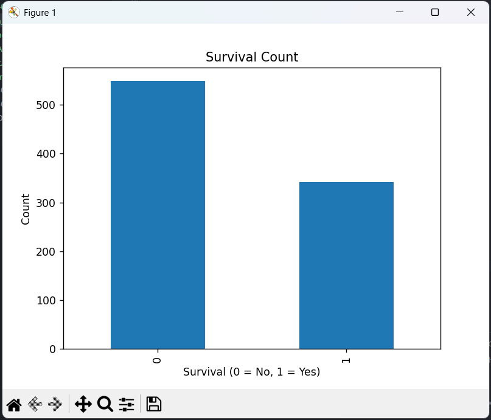
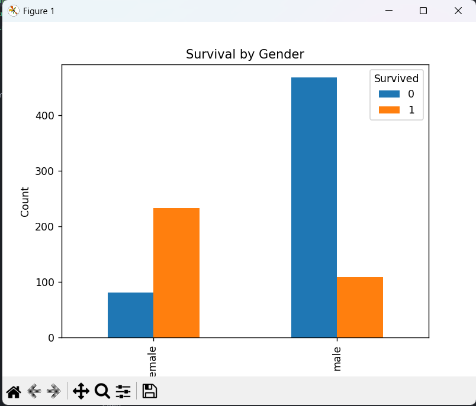
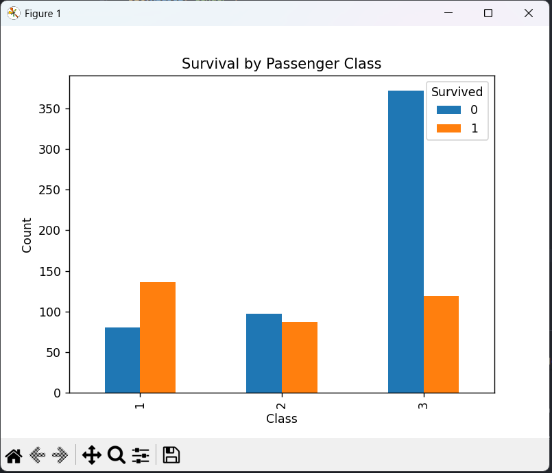

# Task-02: Titanic Dataset – Exploratory Data Analysis (EDA)

## 📌 Objective
The objective of this task is to perform data cleaning and exploratory data analysis (EDA) on the Titanic dataset to identify patterns, trends, and relationships between variables.

---

## 📊 Dataset
- **Dataset Name:** Titanic Dataset
- **Source:** https://www.kaggle.com/c/titanic/data
- **Files Used:** train.csv, test.csv

---

## 🛠️ Tools & Libraries
- Python
- Pandas
- Matplotlib

---

## ⚙️ Steps Performed

1. Loaded the dataset using Pandas.
2. Inspected data structure and identified missing values.
3. Cleaned data by handling missing values and removing irrelevant columns.
4. Performed univariate and bivariate analysis.
5. Visualized relationships between survival and other variables.

---

## 📈 Exploratory Analysis

- Survival count visualization
- Survival comparison by gender
- Survival comparison by passenger class
- Age distribution of passengers

---

## 🔍 Key Insights

- Female passengers had a significantly higher survival rate.
- First-class passengers were more likely to survive.
- Survival probability was influenced by age, gender, and passenger class.
- The data shows clear patterns rather than random outcomes.

---

## ✅ Conclusion
This exploratory data analysis reveals that survival on the Titanic was strongly influenced by social and demographic factors. EDA helped uncover important patterns and relationships within the dataset.

---

## ✨ Author
Harshvardhan Sutar

