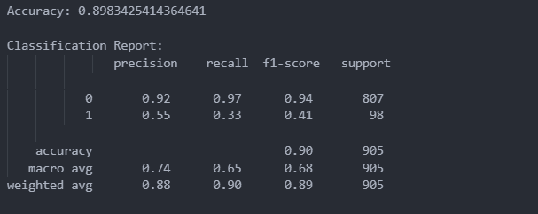

# Task-03: Decision Tree Classifier – Bank Marketing Dataset

## 📌 Objective
The objective of this task is to build a Decision Tree classifier to predict whether a customer will purchase a product (term deposit) based on demographic and behavioral data.

---

## 📊 Dataset
- **Dataset Name:** Bank Marketing Dataset
- **Source:** https://archive.ics.uci.edu/dataset/222/bank+marketing
- **Files Used:** bank.csv

---

## 🛠️ Tools & Libraries
- Python
- Pandas
- Scikit-learn

---

## ⚙️ Steps Performed

1. Loaded the dataset and handled the custom separator.
2. Encoded categorical variables using Label Encoding.
3. Split data into training and testing sets.
4. Trained a Decision Tree classifier.
5. Evaluated the model using accuracy and classification report.

---

## 📈 Model Used
- **Algorithm:** Decision Tree Classifier
- **Criterion:** Gini Index
- **Max Depth:** 5

---

## 🔍 Results & Insights

- The model successfully learned decision rules from customer data.
- Customer subscription depends on multiple factors such as age, job, contact method, and previous campaign outcome.
- Decision Trees provide interpretability by showing how decisions are made.

---

## ✅ Conclusion
This task demonstrates the use of a Decision Tree classifier for predictive modeling on real-world marketing data. Decision Trees are effective for classification problems and provide easy interpretability.

---

## ✨ Author
Harshvardhan Sutar

