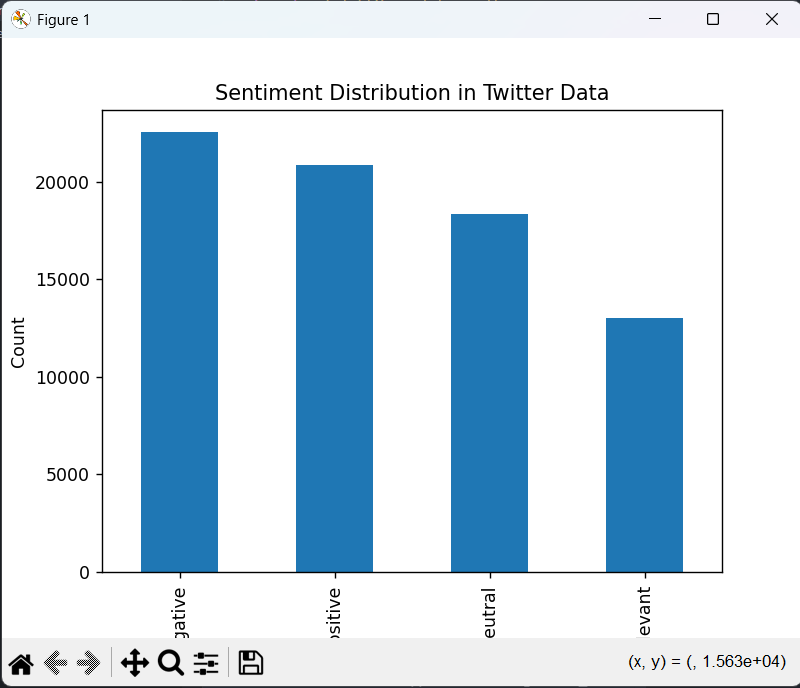
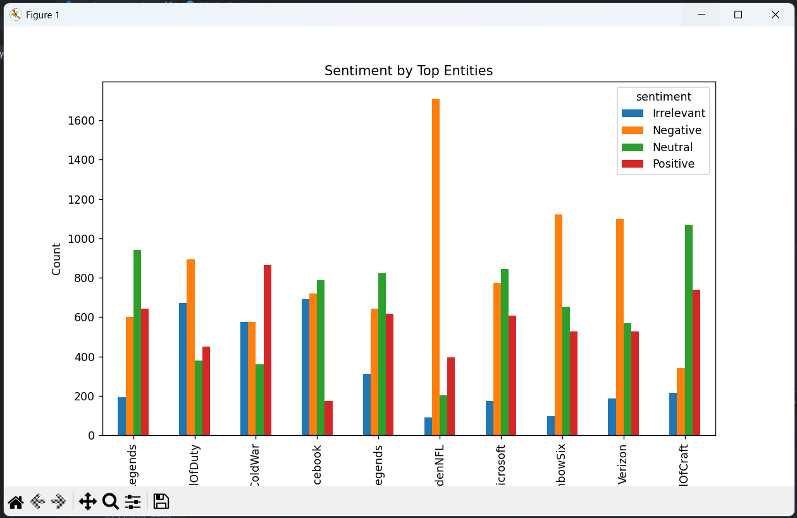

# Task-04: Sentiment Analysis on Twitter Data

## 📌 Objective
The objective of this task is to analyze and visualize sentiment patterns in social media data to understand public opinion and attitudes toward specific topics or brands.

---

## 📊 Dataset
- **Dataset Name:** Twitter Entity Sentiment Analysis
- **Source:** https://www.kaggle.com/datasets/jp797498e/twitter-entity-sentiment-analysis
- **File Used:** twitter_training.csv

---

## 🛠️ Tools & Libraries
- Python
- Pandas
- Matplotlib
- NLTK

---

## ⚙️ Steps Performed

1. Loaded the Twitter dataset and assigned column names.
2. Cleaned tweet text by removing URLs, punctuation, and stopwords.
3. Performed exploratory sentiment analysis.
4. Visualized sentiment distribution.
5. Analyzed sentiment patterns across top entities.

---

## 📈 Exploratory Analysis

- Overall sentiment distribution
- Sentiment comparison across popular entities
- Cleaned text analysis for better interpretation

---

## 🔍 Key Insights

- Negative sentiment is dominant in social media discussions.
- Sentiment varies significantly across different brands and topics.
- Neutral sentiment often represents informational content.
- Public opinion on social media is highly dynamic and entity-specific.

---

## ✅ Conclusion
This analysis demonstrates how sentiment analysis can be used to extract meaningful insights from social media data. Visual exploration helps identify trends and public attitudes toward brands and topics.

---

## ✨ Author
Harshvardhan Sutar

